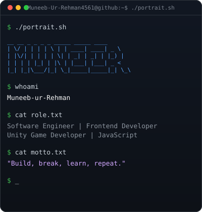

  

<table>
  <tr>
    <td valign="top"></td>
    <td valign="top"></td>
  </tr>
</table>

<!-- HERO SECTION -->

  <h3><strong>Software Engineer | Frontend Developer | Unity Game Developer</strong></h3>
  
<i>Building modern web experiences with React and JavaScript.</i>

  

    
    
  

  

 

<!-- ================= ABOUT ME ================= -->
<h2 align="center">🚀 About Me</h2>

<table width="100%" border="0">
<tr>
<td width="40%" valign="top" style="border: none; background: none;">

### 👨‍💻 Who am I?

* 💻 **Frontend Developer** — I build things for the web with **React** and **JavaScript**.
* 🌱 Currently learning **modern JavaScript, the React ecosystem, and responsive web design.**
* 🎮 **Unity Game Developer** exploring interactive experiences.
* 📍 Based in **Islamabad**.

<blockquote>
  

    <i>"Build, break, learn, repeat."</i>
  

</blockquote>

</td>

<td width="60%" align="center" valign="middle" style="border: none; background: none;">

</td>
</tr>
</table>

---

<!-- SKILLS SHOWCASE -->
<h2>⚡ Tech Stack</h2>

<table width="100%" align="center">
  <tr>
    <td width="50%" valign="top">
      <h3>💻 Languages</h3>
      
        
      <h3>🎨 Frontend</h3>
      
        
      <h3>⚙️ Backend</h3>
      
    </td>
    <td width="50%" valign="top">
      <h3>🎮 Game Development</h3>
      
Unity • C# • Game Design

       
      <h3>🛠️ Tools & Platforms</h3>
      
        
      <h3>📚 Currently Learning</h3>
      
Modern JavaScript • React Ecosystem • Responsive Web Design

    </td>
  </tr>
</table>

<!-- PROJECTS -->
<h2>💼 Featured Projects</h2>

<table width="100%">
  <tr>
    <td width="50%" valign="top">
      <h3>🔭 <a href="https://github.com/Muneeb-ur-Rehman4561/testRepo">testRepo</a></h3>
      
React / Create React App playground for experimenting with components and ideas.

      

        <code>React</code> <code>JavaScript</code>
      

      <ul>
        <li>✔ Component experiments</li>
        <li>✔ Learning playground</li>
      </ul>
    </td>
    <td width="50%" valign="top">
      <h3>🌱 <a href="https://github.com/Muneeb-ur-Rehman4561/Muneeb-ur-Rehman4561.github.io">Portfolio Site</a></h3>
      
Web coursework & experiments — live portfolio showcasing projects.

      

        <code>HTML</code> <code>CSS</code> <code>JavaScript</code>
      

      <ul>
        <li>✔ Live at muneeburrehmansportfolio.netlify.app</li>
        <li>✔ Coursework & experiments</li>
      </ul>
    </td>
  </tr>
</table>

<!-- EXPERIENCE -->
<h2>🚀 Experience</h2>

On my journey as a developer, I have been building and learning across the modern web.

<table width="100%">
  <tr>
    <td width="33%" valign="top">
      <h3>🌐 Frontend Development</h3>
      <ul>
        <li>React Components</li>
        <li>JavaScript (ES6+)</li>
        <li>Responsive Web Design</li>
        <li>HTML5 & CSS3</li>
      </ul>
    </td>
    <td width="33%" valign="top">
      <h3>🎮 Game Development</h3>
      <ul>
        <li>Unity Engine</li>
        <li>Interactive Experiences</li>
      </ul>
    </td>
    <td width="34%" valign="top">
      <h3>🛠️ Tools & Workflow</h3>
      <ul>
        <li>Git & GitHub</li>
        <li>Netlify Deployments</li>
      </ul>
    </td>
  </tr>
</table>

<!-- GITHUB STATS -->
<h2>📈 GitHub Analytics</h2>

  
  

  

    
  

  

    
  

