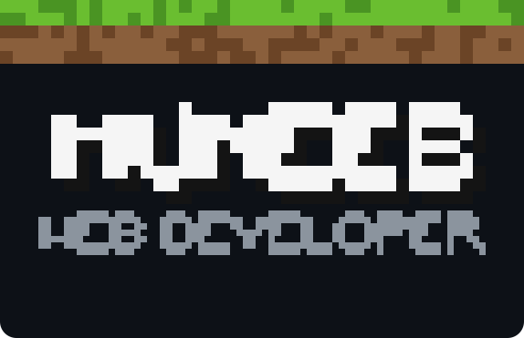
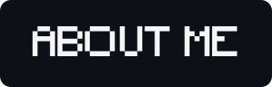
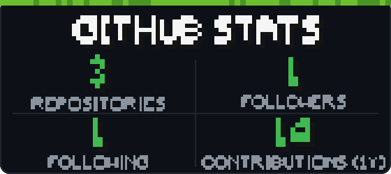

  

  
  

  

- 🌱 Web developer — I build things for the web with **React** and **JavaScript**.
- 🧠 Currently learning: modern JavaScript, the React ecosystem, responsive web design.
- ⚡ Motto: *Build, break, learn, repeat.*

  

  

  

- 🔭 [**testRepo**](https://github.com/Muneeb-Ur-Rehman4561/testRepo) — React / Create React App playground.
- 🌱 [**Muneeb-ur-Rehman4561.github.io**](https://github.com/Muneeb-Ur-Rehman4561/Muneeb-ur-Rehman4561.github.io) — web coursework & experiments.
- ✨ [**Muneeb-Ur-Rehman4561**](https://github.com/Muneeb-Ur-Rehman4561/Muneeb-Ur-Rehman4561) — this profile.

  

  

  

